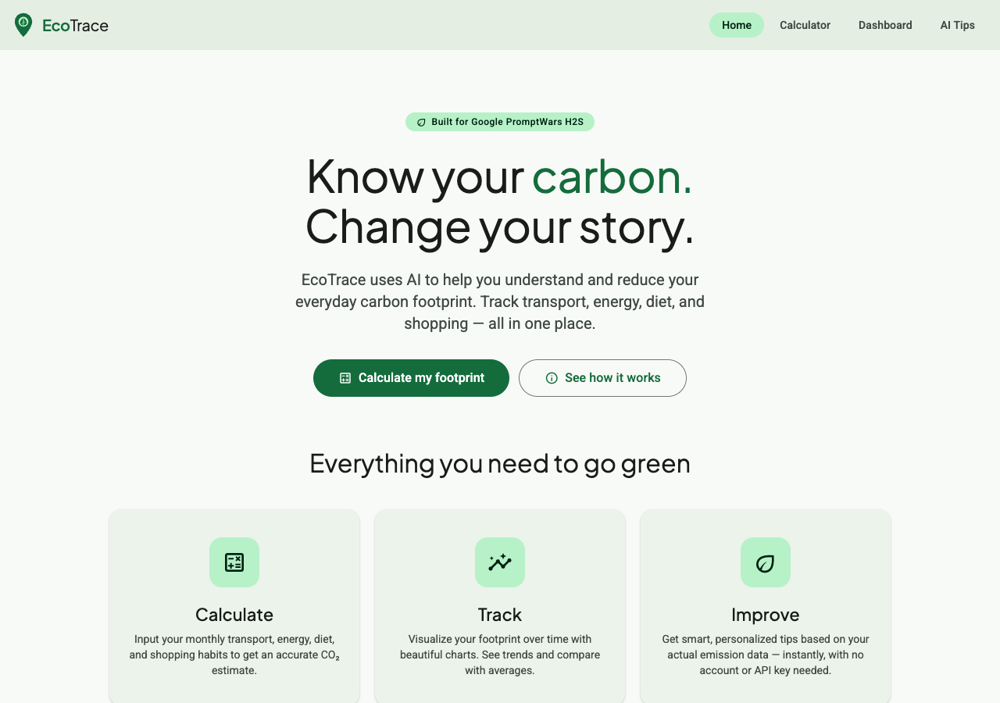

# EcoTrace 🍃

**Track your impact. Shape your future.**

EcoTrace is a Carbon Footprint Awareness Platform that helps you measure, track, and reduce your personal carbon footprint — built with pure Material Design 3, zero dependencies, and zero API keys required.

> Built for **Google PromptWars H2S · Skill Challenge**

---

## Screenshot



---

## Features

- 🌍 **CO₂ Calculator** — Real-time gauge tracking transport, energy, diet & shopping emissions
- 📊 **Dashboard** — Line & doughnut charts with full history and delete support
- 💡 **Smart Tips** — 28 curated, personalised eco tips ranked by your highest emission categories — no API key needed
- 🎨 **Material Design 3** — Full MD3 token system, hand-crafted components, tonal elevation
- ♿ **Accessible** — ARIA labels, keyboard nav, skip links, focus rings, ≥90 Lighthouse a11y

---

## Setup

No server. No build step. No dependencies. No API key.

```bash
# 1. Clone the repo
git clone https://github.com/your-username/EcoTrace-Carbon-Footprint-Awareness-Platform-H2S.git

# 2. Open the homepage
open index.html   # macOS
# — or just double-click index.html in Finder / Explorer
```

Navigate between pages using the top app bar (desktop) or bottom navigation (mobile).

---

## Run Tests

```bash
node tests/test-co2.js
```

All 10 tests pass:

```
✓ car 100km = 21kg
✓ flight 100km = 25.5kg
✓ public 100km = 8.9kg
✓ electricity 100kwh = 23.3kg
✓ gas 100kwh = 20.3kg
✓ diet vegan = 19.8kg
✓ diet heavy_meat = 99kg
✓ shopping low = 10kg
✓ low footprint < 200
✓ high footprint > 400

10 passed, 0 failed
```

---

## Project Structure

```
EcoTrace/
├── index.html          # Landing page
├── calculator.html     # CO₂ Calculator with live gauge
├── dashboard.html      # Charts + history
├── tips.html           # Smart eco tips
├── css/
│   ├── tokens.css      # MD3 color, type, shape & elevation tokens
│   ├── components.css  # Top bar, cards, buttons, inputs, chips, snackbar
│   └── pages.css       # Page-specific layout
├── js/
│   ├── config.js       # CO₂ coefficients — single source of truth
│   ├── storage.js      # localStorage module (safe JSON, history CRUD)
│   ├── calculator.js   # Emission logic + animated gauge
│   ├── dashboard.js    # Chart.js + MD3 theme
│   ├── tips.js         # Rule-based tip engine (28 curated tips)
│   └── ripple.js       # MD3 ripple effect
├── assets/
│   ├── logo.svg        # Leaf-pin SVG logo
│   └── homepage.png    # Homepage screenshot
├── tests/
│   └── test-co2.js     # Unit tests (vanilla Node.js, no deps)
└── README.md
```

---

## Tech Stack

| Layer | Technology |
|-------|-----------|
| Structure | HTML5 Semantic |
| Styling | Vanilla CSS3 (MD3 custom properties) |
| Logic | Vanilla JS ES6 Modules |
| Charts | Chart.js 4 via CDN |
| Fonts | Plus Jakarta Sans + Roboto (Google Fonts) |
| Icons | Material Symbols Outlined (Google Fonts) |
| Storage | `localStorage` |
| AI / Backend | **None** |
| Build tools | **None** |

---

## CO₂ Coefficients

| Activity | Factor |
|---------|--------|
| Car | 0.21 kg / km |
| Flight | 0.255 kg / km |
| Public transport | 0.089 kg / km |
| Electricity | 0.233 kg / kWh (India grid) |
| Natural gas | 0.203 kg / kWh |
| Vegan diet | 19.8 kg / month |
| Moderate meat | 59.4 kg / month |
| Heavy meat | 99.0 kg / month |
| Low shopping | 10.0 kg / month |
| Medium shopping | 25.0 kg / month |
| High shopping | 45.0 kg / month |

---

## Accessibility

- `<html lang="en">` on every page
- Skip navigation link on every page
- All inputs have explicit `<label for>` associations
- Live gauge has `aria-live` + `aria-label` updated by JS
- Charts have descriptive `aria-label` on `<canvas>`
- All interactive elements keyboard-reachable
- Focus ring: 2px solid primary, 2px offset
- Badges always include a text label (never colour-only)
- Respects `prefers-reduced-motion`

---

## License

MIT — Built for **Google PromptWars H2S**
